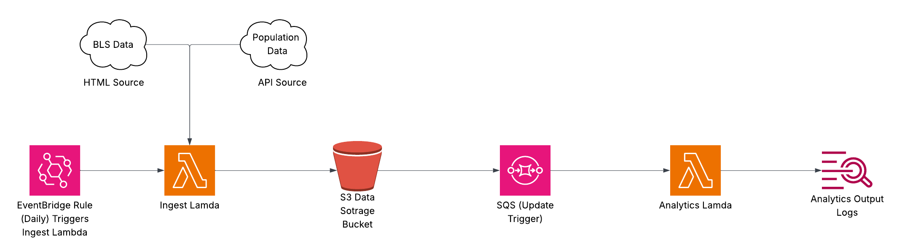

# Data Quest

- This is the architecture diagram that I have built according to quest requirements



## Submission

Tech stack that I have used in this project is:
1. Python (Pandas,Numpy)
2. Lambda
3. SQS
4. S3
5. AWS Cloudformation and CDK

### Step 1 – BLS Dataset Ingestion

🔹 **What was done**:  
Fetched time-series data files from the BLS public FTP directory: [https://download.bls.gov/pub/time.series/pr/](https://download.bls.gov/pub/time.series/pr/).  
Each file was downloaded and uploaded to S3 only if:
- It didn’t already exist in the bucket
- It had changed since the last fetch

Stale files (no longer present on BLS site) were removed from the bucket.

🔹 **Handled Challenges**:
- BLS blocks generic bots — used `User-Agent` with contact info to comply with access policies
- Removed nested path structure to keep S3 flat

🔹 **S3 Files**:
- [pr.class](https://rearc-asessment.s3.amazonaws.com/pr.class)
- [pr.contacts](https://rearc-asessment.s3.amazonaws.com/pr.contacts)
- [pr.data.0.Current](https://rearc-asessment.s3.amazonaws.com/pr.data.0.Current)
- [pr.data.1.AllData](https://rearc-asessment.s3.amazonaws.com/pr.data.1.AllData)
- [pr.duration](https://rearc-asessment.s3.amazonaws.com/pr.duration)
- [pr.footnote](https://rearc-asessment.s3.amazonaws.com/pr.footnote)
- [pr.measure](https://rearc-asessment.s3.amazonaws.com/pr.measure)
- [pr.period](https://rearc-asessment.s3.amazonaws.com/pr.period)
- [pr.seasonal](https://rearc-asessment.s3.amazonaws.com/pr.seasonal)
- [pr.sector](https://rearc-asessment.s3.amazonaws.com/pr.sector)
- [pr.series](https://rearc-asessment.s3.amazonaws.com/pr.series)
- [pr.txt](https://rearc-asessment.s3.amazonaws.com/pr.txt)

🔹 **Source code**: [`/part1.py`](./part1.py)

---

### Step 2 – Population API Ingestion

🔹 **What was done**:  
Fetched U.S. population data from [Data USA API](https://honolulu-api.datausa.io/tesseract/data.jsonrecords?cube=acs_yg_total_population_1&drilldowns=Year%2CNation&locale=en&measures=Population).  
The result was saved as `population.json` to the same S3 bucket.

🔹 **S3 File**:
- [population.json](https://rearc-asessment.s3.amazonaws.com/population.json)

🔹 **Source code**: [`/part2.py`](./part2.py)

---

### Step 3 – Data Analytics

🔹 **What was done**:
Using Pandas in Jupyter Notebook, performed the following:

1. **Calculated** the mean and standard deviation of U.S. population between 2013–2018.
2. **Identified** the best year (max annual sum of quarterly values) for each `series_id` in the BLS dataset.
3. **Joined** both datasets to extract value for `PRS30006032`, period `Q01`, along with population for that year.

🔹 **Cleaning Steps**:
- Trimmed whitespace from columns
- Handled NaNs
- Ensured correct data types for joins

🔹 **Output**:
All results are available as tables and comments inside the notebook.

🔹 **Source code & results**: [`/part3.ipynb`](./part3.ipynb)

---

### Step 4 – Infrastructure as Code with AWS CDK

🔹 **What was done**:

Used **AWS CDK** to automate the entire pipeline:

1. **Lambda Function 1 (Ingest)**:
   - Combines logic from Part 1 and Part 2
   - Scheduled via EventBridge to run **daily**
   - Uploads both BLS files and population.json to S3

2. **S3 Notification → SQS Queue**:
   - When `population.json` is uploaded, a message is sent to an SQS queue

3. **Lambda Function 2 (Analytics)**:
   - Triggered by SQS
   - Performs analytics from Part 3 using Pandas
   - Logs result to **CloudWatch Logs**

🔹 **CDK Stack Components**:
- `lambda_ingest/handler.py`: Runs sync + API fetch
- `lambda_analytics/handler.py`: Runs all analytics queries
- `pipeline_stack.py`: Orchestrates Lambdas, S3, SQS, IAM, and EventBridge

🔹 **Source code**: [`/data-pipeline-cdk/`](./data-pipeline-cdk/)

---

## Running the AWS CDK IaC

1. Navigate to the `data-pipeline-cdk` folder:
   ```bash
   cd data-pipeline-cdk

2. Install dependencies:
   ```bash
   npm install -g aws-cdk
   pip install -r lambda_ingest/requirements.txt -t lambda_ingest/
   pip install -r lambda_analytics/requirements.txt -t lambda_analytics/

3. Bootstrap the environment:
   ```bash
   cdk bootstrap

4. Deploy the CDK stack:
   ```bash
   cdk deploy

5. Trigger ingestion:

Wait for the daily run, or manually invoke IngestFunction from the AWS Console

6. Check logs:

Go to CloudWatch > Logs > AnalyticsFunction to see analytic outputs

